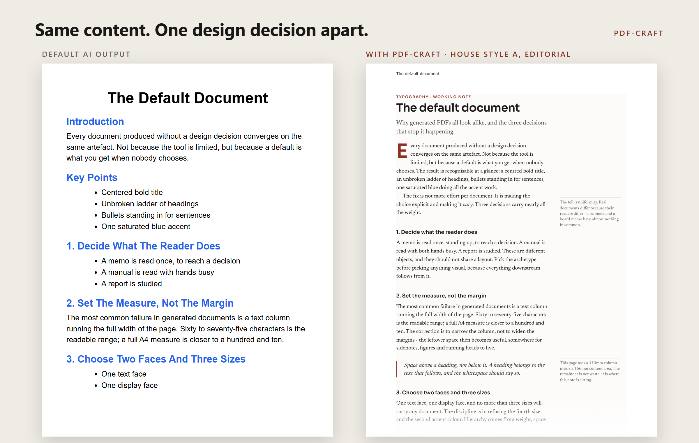

<div align="center">

# pdf-craft

**A Claude Code skill that makes AI-generated PDFs look designed instead of defaulted.**




</div>

---

## The problem

You can spot an AI-generated document from across the room: Arial, a centred bold title, a
ladder of H1/H2/H3, bullets everywhere, one saturated blue. No design decision gets made, so
the default wins. And when a decision does get made once, it's repeated forever.

pdf-craft fixes both problems. It turns "make me a PDF" into a real typographic brief, and it
keeps a ledger so no two documents come out in the same style.

## How it works

1. **Design brief first.** Before any HTML, the agent commits to five decisions: archetype,
   house style, page geometry, type pairing and accent. No brief, no document.
2. **Six house styles, picked by what the reader does.** Each one is a full specification,
   not a theme.

   | Style | For | Signature |
   |---|---|---|
   | A · Editorial | reports, essays, whitepapers | sidenotes in the margin, raised initial |
   | B · Technical brief | RFCs, design docs, postmortems | hanging decimal numbering, spec tables |
   | C · Executive memo | 1–3 page decisions | a boxed *Decision required*, no bullets |
   | D · Data report | metrics and tables | decimal-aligned tabular figures, no gridlines |
   | E · Field guide | manuals, runbooks | big hanging step markers, caution panels |
   | F · Proposal | pitches, client docs | full-bleed cover band, pull quotes |

3. **A style ledger.** Every render is logged, and the next document has to pick a
   different style.
4. **A dependency-free renderer.** `topdf.mjs` drives headless Chrome directly over the
   DevTools Protocol. You get running heads and page numbers, and it waits for webfonts.
   `chrome --print-to-pdf` can't do any of that.
5. **Verified before shipping.** `checkpdf.mjs` reads the PDF's embedded fonts and fails if
   anything silently fell back to Times.

## Hard-won rendering facts

These are built into the skill so the agent doesn't have to rediscover them:

- **Variable fonts don't embed** in Chrome's PDF output. They silently fall back to Times.
  `getfont.mjs` downloads static instances one weight at a time.
- **Headless Chrome won't fetch remote fonts**, even with a long virtual-time budget.
  Fonts must be local `file:` URLs.
- **Chrome ignores `@page` margin boxes**, so the renderer draws page numbers itself.
- An **unquoted multi-word font family** can invalidate the whole declaration.

## Install

```bash
git clone https://github.com/Nightdreams-bat/pdf-craft ~/.claude/skills/pdf-craft
```

Requirements: Node 18+ and Chrome or Chromium (or set `CHROME_PATH`). No `npm install`.

Then ask Claude Code for any report, memo, proposal or one-pager as a PDF, and the skill
triggers automatically.

## Use the scripts directly

```bash
node scripts/getfont.mjs "Newsreader:400,600,400italic" "Sora:600"   # prints @font-face CSS
node scripts/topdf.mjs doc.html --out=doc.pdf --margin=22 --header="Report title"
node scripts/checkpdf.mjs doc.pdf                                      # pages, size, embedded fonts
```

Try it on the bundled example:

```bash
node scripts/topdf.mjs example/editorial.html --margin=22 --header="The default document"
```

## No skill? Paste this prompt

> Before writing anything, give me a five-line design brief: archetype, house style, page
> size and margin, type pairing with weights, and one accent colour. Then build the document
> to that brief. Banned: Arial/Helvetica/Times/Calibri as the chosen face, centred bold title
> over an H1/H2/H3 ladder, bullets as the main structure, generic blue accents, gradients,
> emoji bullets, uniform margins with a full-width text column, more than three type sizes.

## License

Code and skill are MIT. The bundled fonts (Newsreader, Sora, IBM Plex) are under the SIL Open
Font License.
